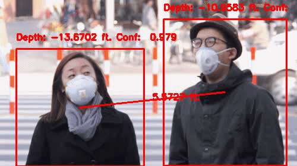

# Covid-19 Risk Video Analysis
This is an integration of a social distancing algorithm, a face mask detecting algorithm, and a person detecting algorithm. It is designed to track the number of people who pass through a video clip, including whether or not they are wearing masks, and whether or not they are social distancing. It will annotate the video frame by frame with this analysis, and can display the annotation live, or write it to an output file .avi file. Finally, when the video stream ends, it will write a csv of data to a specified output file location, including time series data for all frames of the video, and a calculated Risk Index between 0 and 100.

## Requirements
Found in requirements.txt. User must install:
- tensorflow>=1.15.2
- keras>=2.3.1
- imutils>=0.5.3
- numpy>=1.18.2
- opencv-python>=4.2.0.*
- matplotlib>=3.2.1
- argparse>=1.1
- scipy>=1.4.1
- scikit-learn>=0.23.1
- pillow>=7.2.0

## Demo:
This is an example of the mask detection functionality being run on the live stream from a laptop camera.




## Methodology


## Usage:
Before running any main functions, run the command `<pip3 install -r requirements.txt>` (or `<pip install -r requirements.txt>`, depending on your python environment).

The main function for video and image processing facemask_tracking.py. This file optionally takes as input a prerecorded video, a preexisting image, or a camera id; if no video, image, or camera id is provided as input, it will by default run on the video stream from the default camera of the device. 

#### Parameters and Flags:

- "--input" or "-i" is a flag available to specify an input source for video or images. It can be passed "0" to use the default camera for video streaming, a different camera id if known, or a relative or absolute path to a prerecorded video. Extensions supported include .avi, .mp4, and .mov for video, and .jpg, .jpeg, and .png for static image.
```bash
python3 facemask_tracking.py -i 0
python3 facemask_tracking.py --input ./input_images_and_videos/pedestrian_survaillance.mp4
```

- "--type" or "-t" is a flag available to specify whether the input is a video ("video"), or an image("image"). The default, if no type is specified, is "video".
```bash
python3 facemask_tracking.py -i 0 --type video
python3 facemask_tracking.py --input ./input_images_and_videos/pedestrian_survaillance.mp4 -t video
python3 facemask_tracking.py --input ./images/pic1.jpeg --type image
```

- "--live_view" or "-l" is a flag to indicate whether the annotated frames of the input video will be displayed as they are created. The default is True. If this is changed to anything but True, then no real-time display of annotated frames will occur.
```bash
python3 facemask_tracking.py -l False
```

- "--csv_out" or "-c" is a parameter to specify the path where a csv of output data will be written. Any file already at the output path will be overwritten. The default is `<./output.csv>`. If `<None>` is passed, there will be no output.
```bash
python3 facemask_tracking.py --csv_out None
python3 facemask_tracking.py -c ./new_output.csv
```

- "--video_out" or "-v" is a parameter to specify the path where the video output will be stored. The default value is "False", indicating that no video output will be created.
```bash
python3 facemask_tracking.py --video_out ./output_video.avi
```

- "--roi" or "-r" is a flag available to specify the relative position of the ROI (region of interest) within the frames being analyzed. By default, it is 0.5, indicating that the ROI will be a vertical line in the middle of the frame. This should be a value between 0 and 1.
```bash
python3 facemask_tracking.py --roi 0.25
python3 facemask_tracking.py -v 0 -r 0.8
```

- "--deviation" or "-d" is a flag available to specify the width of the detection area around the ROI. By default, it is 10 pixels.
```bash
python3 facemask_tracking.py --deviation 10
python3 facemask_tracking.py -r 0.4 -d 15
```

#### Combined example:
```bash
python3 facemask_tracking.py -i ./input_images_and_videos/traffic_light.mp4 -c ./new_output.csv -v ./output_video.avi -r 0.8 -d 15
```


## Tuning the detection algorithms
There is a tradeoff between detecting a single person more than once (multiple detections) and not detecting a person at all (zero detections). This tradeoff relies on the fps (frames per second) of the video, and on the value of --deviation. The larger --deviation is, the more likely we are to count a single person multiple times, and the less likely we are to miss anyone. With higher fps, it is possible to decrease the value of the deviation, decreasing the area of detection, and thus reduce the number of mulitple-counts we get, without missing individuals.


## Face Mask Model Sourced From:
[Face-Mask-Detection](https://github.com/chandrikadeb7/Face-Mask-Detection) by [Chandrika Deb](https://github.com/chandrikadeb7), 2020.

## Base Object Detection API Sourced From:
[TensorFlow Object Counting API](https://github.com/ahmetozlu/tensorflow_object_counting_api) by [Ahmet Özlü](https://github.com/ahmetozlu), 2018.

## Social Distance Detection
The Social Distance Detection model is lightweight and accurate. The model can easily be executed in live-stream by running the following command:
```bash
python custom_social_distance_detection.py --prototxt SSD_MobileNet_prototxt.txt --model SSD_MobileNet.caffemodel --labels class_labels.txt 
```
### Parameters
The parameters give the user the flexibility to:

* edit a video, gif, or live-stream
* record the edited output
* adjust focal length to one's personal camera
* adjust the minimum confidence threshold
* select a custom caffe model
* select their own proto txt 
* select one's own custom labels

A full example of using all the above parameters may be seen below:

```bash
python custom_social_distance_detection.py --prototxt SSD_MobileNet_prototxt.txt --model SSD_MobileNet.caffemodel --labels class_labels.txt --video .\covid_masks.gif --focal 500 --record 1
```

## Framework
Both, the Object Counting framework and the Social Distancing framework are processed by SSD MobileNetv1 to take advantage of its lightweight operations for real-time tracking.

As for the Face Mask Detection architecture, input data is processed through MobileNetV2 with SSD to take advantage of residual operations, which increase accuracy at a low trade-off for speed


